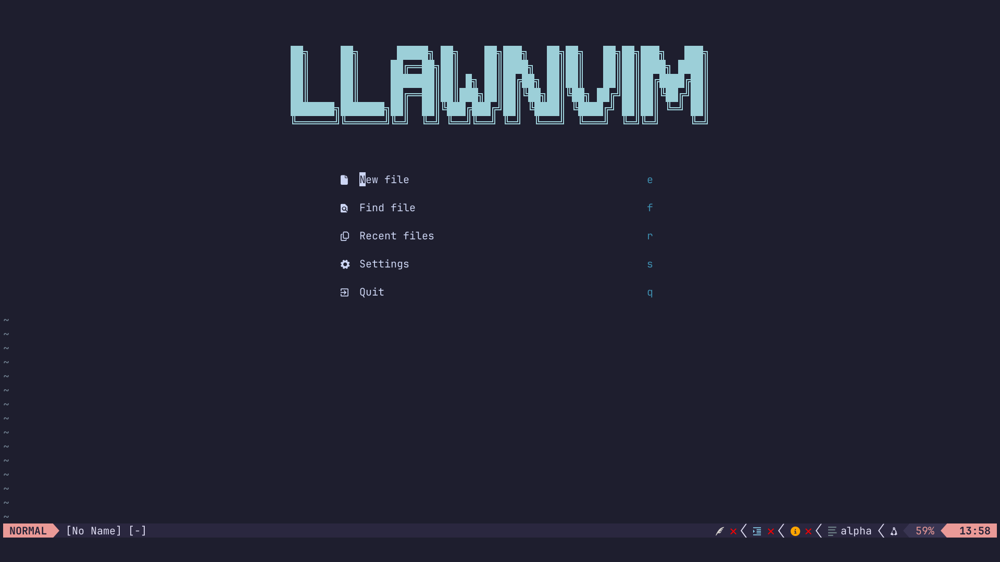

```markdown
   ██╗     ██╗      █████╗ ██╗    ██╗███╗   ██╗██╗   ██╗██╗███╗   ███╗
   ██║     ██║     ██╔══██╗██║    ██║████╗  ██║██║   ██║██║████╗ ████║
   ██║     ██║     ███████║██║ █╗ ██║██╔██╗ ██║██║   ██║██║██╔████╔██║
   ██║     ██║     ██╔══██║██║███╗██║██║╚██╗██║╚██╗ ██╔╝██║██║╚██╔╝██║
   ███████╗███████╗██║  ██║╚███╔███╔╝██║ ╚████║ ╚████╔╝ ██║██║ ╚═╝ ██║
   ╚══════╝╚══════╝╚═╝  ╚═╝ ╚══╝╚══╝ ╚═╝  ╚═══╝  ╚═══╝  ╚═╝╚═╝     ╚═╝
```

______________________________________________________________________


[](https://llawn.github.io/llawnvim/)

# LLawn Neovim Configuration

My personal Neovim configuration, modular and optimized for multiple languages

This configuration draws inspiration from:

- [ThePrimeagen's init.lua](https://github.com/ThePrimeagen/init.lua)
- [Josean Martinez's dev-environment-files](https://github.com/josean-dev/dev-environment-files)
- [TJ DeVries' config.nvim](https://github.com/tjdevries/config.nvim)

This configuration is continuously updated and modular, making it easy to expand
with new languages or plugins.



## Documentation

Full documentation is available at
[https://llawn.github.io/llawnvim/](https://llawn.github.io/llawnvim/)

## Installation

1. Clone this repository:

```bash
git clone git@github.com:llawn/llawnvim.git
```

1. Install plugins using Lazy:

```vim
:Lazy sync
```

1. Open Neovim and enjoy your fully configured setup.

The configuration uses lock files (`lazy-lock.json`, `mason-lock.json`,
`treesitter-lock.json`) to ensure reproducible installations across
environments.

## Features

| Plugin                                                                  | Description                | Version |
| ----------------------------------------------------------------------- | -------------------------- | ------- |
| [rose-pine](https://github.com/rose-pine/neovim)                        | Color scheme               | cf2a288 |
| [harpoon](https://github.com/ThePrimeagen/harpoon/tree/harpoon2)        | File navigation            | 87b1a35 |
| [lazygit](https://github.com/kdheepak/lazygit.nvim)                     | Git integration            | a04ad0d |
| [lualine](https://github.com/nvim-lualine/lualine.nvim)                 | Status line                | 47f91c4 |
| [neogen](https://github.com/danymat/neogen)                             | Documentation generation   | 23e7e9f |
| [nvim-cmp](https://github.com/hrsh7th/nvim-cmp)                         | Completion engine          | 85bbfad |
| [cmp-nvim-lsp](https://github.com/hrsh7th/cmp-nvim-lsp)                 | LSP completion integration | cbc7b02 |
| [mason](https://github.com/williamboman/mason.nvim)                     | LSP server manager         | 44d1e90 |
| [mason-lspconfig](https://github.com/williamboman/mason-lspconfig.nvim) | Mason LSP bridge           | fe66109 |
| [conform](https://github.com/stevearc/conform.nvim)                     | Code formatter             | c2526f1 |
| [nvim-lint](https://github.com/mfussenegger/nvim-lint)                  | Linter                     | ca6ea12 |
| [telescope](https://github.com/nvim-telescope/telescope.nvim)           | Fuzzy finder               | a8c2223 |
| [treesitter](https://github.com/nvim-treesitter/nvim-treesitter)        | Syntax highlighting        | 42fc28b |
| [undotree](https://github.com/mbbill/undotree)                          | Undo tree                  | 178d19e |
| [which-key](https://github.com/folke/which-key.nvim)                    | Key binding hints          | 3aab214 |
| [lexima](https://github.com/cohama/lexima.vim)                          | Auto close parentheses     | ab621e4 |
| [yazi](https://github.com/mikavilpas/yazi.nvim)                         | File manager               | 4a8bd32 |
| [alpha](https://github.com/goolord/alpha-nvim)                          | Dashboard                  | 3979b01 |

- Built-in **LSP setup** using Neovim 0.11+ `vim.lsp.enable`.
- Custom menus for Git, Treesitter, Mason and more.

[More features](https://llawn.github.io/llawnvim/features/)

## Language Server Protocol

[LSP configurations](https://llawn.github.io/llawnvim/lsp/)

Integrated with [conform](https://github.com/stevearc/conform.nvim) for
formatting and [nvim-lint](https://github.com/mfussenegger/nvim-lint) for
linting, both auto-detecting tools from Mason.

| Language     | LSP Server                                                              |
| ------------ | ----------------------------------------------------------------------- |
| C/C++        | [clangd](https://clangd.llvm.org)                                       |
| Flutter/Dart | flutter_ls                                                              |
| Fortran      | [fortls](https://fortls.fortran-lang.org)                               |
| Go           | [gopls](https://go.dev/gopls/)                                          |
| Lua          | [lua_ls](https://luals.github.io/)                                      |
| Python       | [ty](https://docs.astral.sh/ty/) + [ruff](https://docs.astral.sh/ruff/) |

## Treesitter Parsers

The following parsers are automatically installed and configured:

| Language          | Treesitter Parser                                                                                                                                         |
| ----------------- | --------------------------------------------------------------------------------------------------------------------------------------------------------- |
| lua               | [lua](https://github.com/tree-sitter-grammars/tree-sitter-lua)                                                                                            |
| vim               | [vim](https://github.com/tree-sitter-grammars/tree-sitter-vim), [vimdoc](https://github.com/neovim/tree-sitter-vimdoc)                                    |
| markdown          | [markdown](https://github.com/tree-sitter-grammars/tree-sitter-markdown), [markdown_inline](https://github.com/tree-sitter-grammars/tree-sitter-markdown) |
| json              | [json](https://github.com/tree-sitter/tree-sitter-json)                                                                                                   |
| tree-sitter query | [query](https://github.com/tree-sitter-grammars/tree-sitter-query)                                                                                        |

## Keymaps

[Full keymaps documentation](https://llawn.github.io/llawnvim/keymaps/)

## Folder Structure

[Full folder structure documentation](https://llawn.github.io/llawnvim/structure/)
