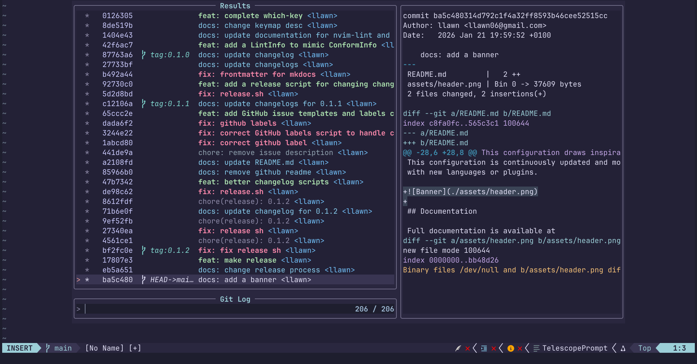
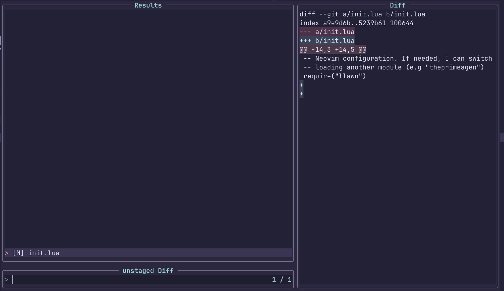
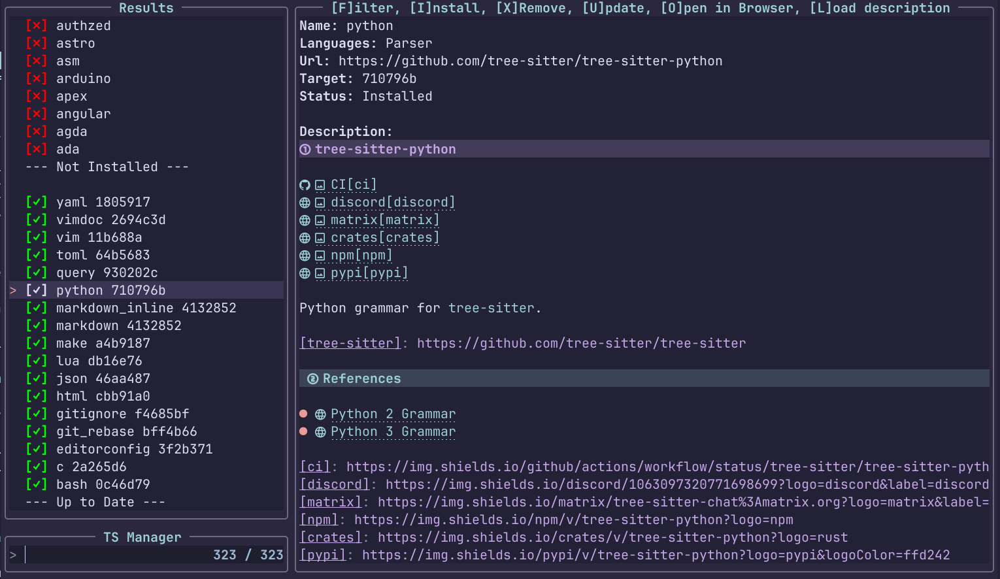
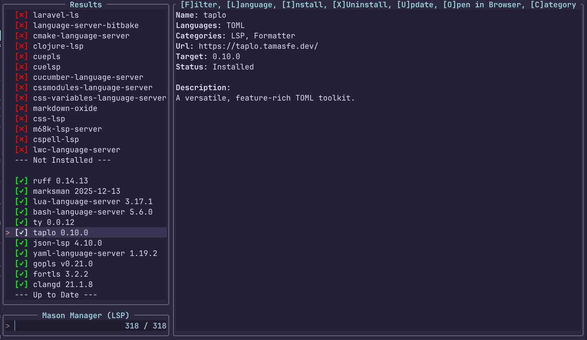
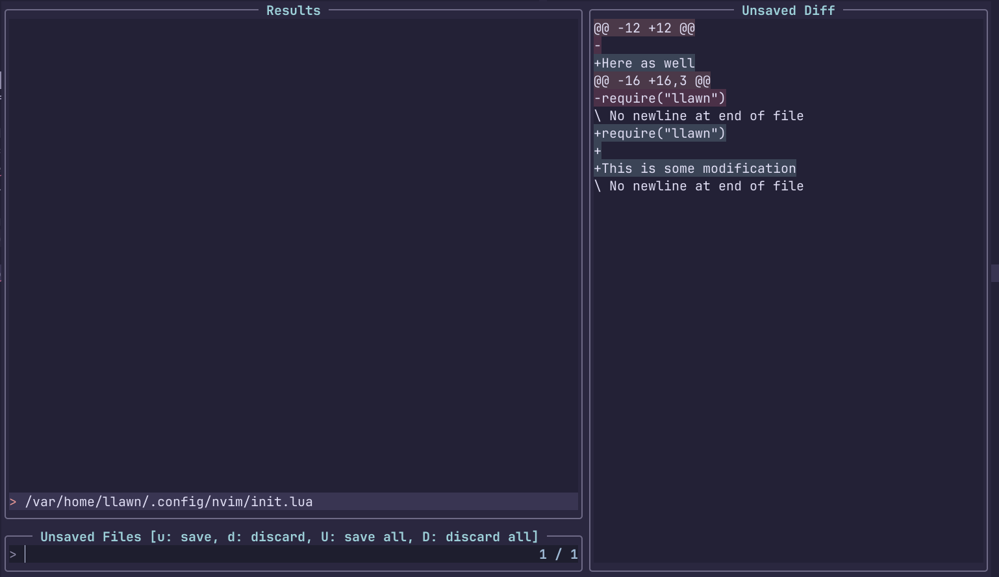
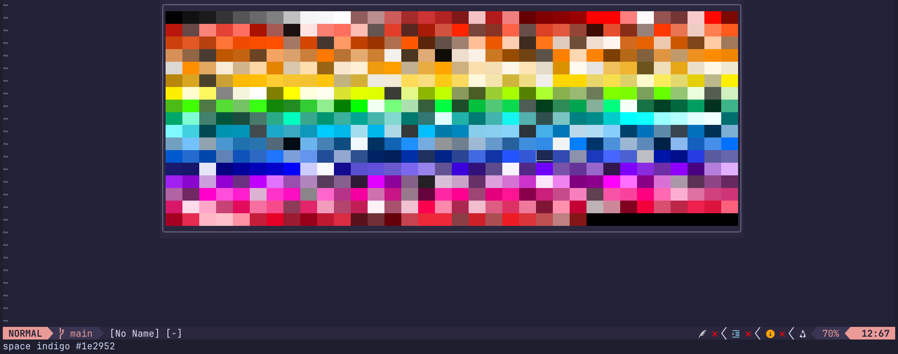
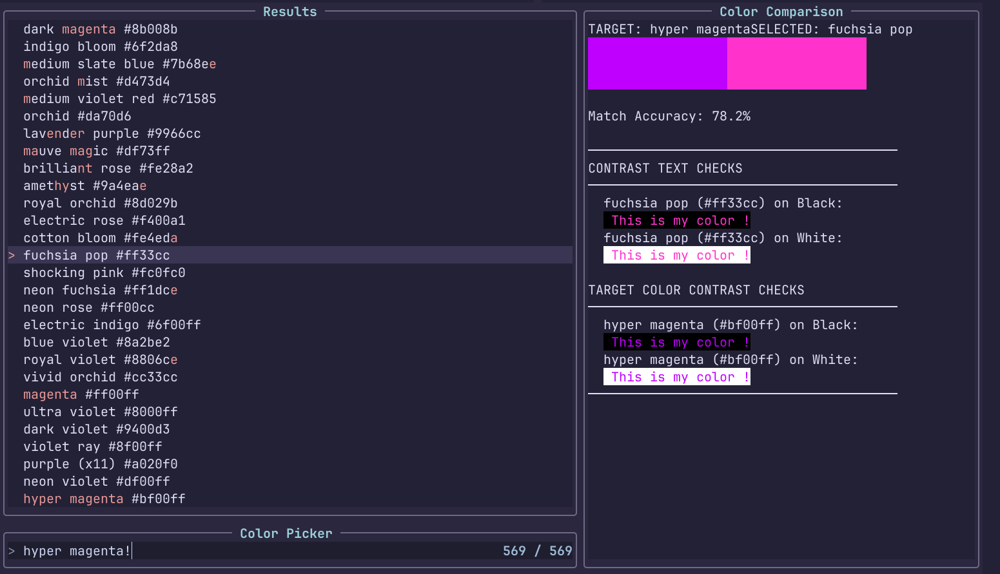
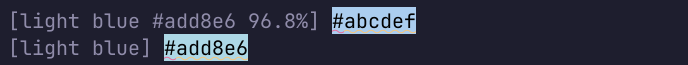

# Features

This page provides a comprehensive overview of the key features and capabilities
of the Llawn Neovim configuration.

## Language Server Protocol (LSP)

Comprehensive LSP support for multiple languages with native Neovim 0.11+
integration. See [LSP Configurations](lsp.md) for detailed setup and
configuration.

## User Interface

### Theme

- **Rose Pine Moon**: A beautiful, low-contrast color scheme
- **Custom Highlights**: Enhanced visibility for invisible characters
- **Transparent Background**: Clean, distraction-free editing

### Status Line

- **Lualine**: Informative status line with git, lsp, treesitter, formatter, and linter integration

- **Mode Indicators**: Clear visual feedback for current mode
- **File Information**: Encoding, file type, and position

### Menus

All menus use Telescope for interactive selection with previews and keybindings
for quick actions.

- **Window Menu** (`<A-w>`): Interactive window management

    - Horizontal/vertical splits
    - Navigation between windows
    - Window closing

- **Git Menu** (`<A-g>`): Advanced git operations

    - **Log**: Fuzzy-searchable commit history with filtering (author, type,
      message)
    - **Diff**: File-by-file diff preview for staged/unstaged changes
    - Browser integration for commits on GitHub/GitLab

Here is the Git Log Menu:

Here is the Git Diff Menu:

- **Treesitter Menu** (`<A-t>`): Parser lifecycle management

    - Install/update/uninstall parsers with status indicators
    - Repository URL access
    - Categorized view (up-to-date, outdated, not installed)

- **Mason Menu** (`<A-m>`): LSP and tool server management

    - Category filtering (LSP, DAP, Linters, Formatters, Other)
    - Package information previews
    - Version status and update management

Additional utility menus accessed via quit operations or keybindings:

- **Unsaved Buffers Menu**: Interactive save/discard for modified files with
  diff previews

- **Swap Files Menu**: Recovery and cleanup of swap files for closed buffers

### File Navigation

- **Harpoon**: Quick file marking and navigation (1-3 keys)
- **Telescope**: Fuzzy finding for files, buffers, help, and grep
- **Yazi**: Modern file manager integration

### Editing Enhancements

- **Clipboard Integration**: System clipboard support
- **Undo Tree**: Visual undo history management
- **Automatic Pair Closing**: Lexima for auto-closing brackets, quotes, and
  customizable pairs

## Development Tools

### Code Generation

- **Neogen**: Generate documentation strings for functions and classes
- **Completion**: Intelligent code completion with LSP integration

### Git Integration

- **LazyGit**: Terminal-based git interface
- **Git Signs**: Inline git status indicators with hunk navigation
- **Telescope Git**: Git file and status browsing

### Productivity

- **Which-Key**: Interactive key binding hints
- **Llawn Colors**: Color pickers (HexColors, ColorPick2D), completion, and
  highlighting with virtual hints

The custom color highlighter provides virtual hints for hex codes and enhances visibility for color-related elements:

### LSP Management

- **Mason**: Automatic LSP server installation
- **Mason Lockfile**: Version locking for installed LSP servers
  (mason-lock.json)
- **Mason-LSPConfig**: Bridge between Mason and nvim-lspconfig

## Configuration Options

### Editor Settings

- **Line Numbers**: Relative numbering with current line absolute
- **Indentation**: 2-space tabs, smart indentation
- **Search**: Incremental search with preview
- **Wrapping**: Soft wrapping with break indent
- **Color Column**: 80-character guide line

### File Handling

- **Persistent Undo**: Undo history survives sessions
- **Backup Management**: Sensible backup and swap file locations
- **File Type Detection**: Enhanced filename patterns

## Plugin Ecosystem

The configuration includes carefully selected plugins that enhance productivity
without bloat. All plugins are lazy-loaded for optimal startup performance.

### Plugin Manager

#### Lazy.nvim

**Repository**: [folke/lazy.nvim](https://github.com/folke/lazy.nvim)

The modern plugin manager for Neovim that provides lazy loading, dependency
management, update checking, and performance profiling.

### Appearance & UI

#### Rose Pine Theme

**Repository**: [rose-pine/neovim](https://github.com/rose-pine/neovim)

A beautiful, warm dark theme with moon variant, transparent background, and
custom highlights for invisible characters.

#### Alpha Dashboard

**Repository**: [goolord/alpha-nvim](https://github.com/goolord/alpha-nvim)

A fast and fully customizable greeter for Neovim with quick access to recent
files, commands, and settings.

#### Lualine Status Line

**Repository**:
[nvim-lualine/lualine.nvim](https://github.com/nvim-lualine/lualine.nvim)

Blazing fast status line with git, LSP and treesitter integration, file
information, and mode indicators.

#### Llawn Colors

**Repository**: [llawn/llawn-colors](https://github.com/llawn/llawn-colors)

Custom color utilities providing color pickers, completion, and highlighting
with virtual hints for hex codes.

### Language Server Protocol (LSP)

#### Mason & Mason-LSPConfig

Automatic LSP server management with auto-installation for clangd, fortls,
gopls, lua_ls, ty, and ruff.

#### Nvim-CMP & CMP-Nvim-LSP

Intelligent code completion with LSP integration, multiple sources, and snippet
support.

### Navigation & Search

#### Telescope

**Repository**:
[nvim-telescope/telescope.nvim](https://github.com/nvim-telescope/telescope.nvim)

Highly extendable fuzzy finder for files, live grep, buffers, and help.

#### Harpoon

**Repository**: [ThePrimeagen/harpoon](https://github.com/ThePrimeagen/harpoon)

Quick file marking and navigation with persistent lists.

### Syntax & Parsing

#### Treesitter

**Repository**:
[nvim-treesitter/nvim-treesitter](https://github.com/nvim-treesitter/nvim-treesitter)

Advanced syntax highlighting, code navigation, and structural editing with
tree-sitter parsers. Comprehensive menu for parser management and automatic
installation for configured languages. Version locking for installed parsers
(treesitter-lock.json).

##### Supported Parsers

The following parsers are automatically installed:

!!! info "Supported Languages"

    | Language          | Treesitter Parser                                                                                                                                         |
    | ----------------- | --------------------------------------------------------------------------------------------------------------------------------------------------------- |
    | lua               | [lua](https://github.com/tree-sitter-grammars/tree-sitter-lua)                                                                                            |
    | vim               | [vim](https://github.com/tree-sitter-grammars/tree-sitter-vim), [vimdoc](https://github.com/neovim/tree-sitter-vimdoc)                                    |
    | markdown          | [markdown](https://github.com/tree-sitter-grammars/tree-sitter-markdown), [markdown_inline](https://github.com/tree-sitter-grammars/tree-sitter-markdown) |
    | json              | [json](https://github.com/tree-sitter/tree-sitter-json)                                                                                                   |
    | tree-sitter query | [query](https://github.com/tree-sitter-grammars/tree-sitter-query)                                                                                        |

#### Render Markdown

**Repository**:
[MeanderingProgrammer/render-markdown.nvim](https://github.com/MeanderingProgrammer/render-markdown.nvim)

Enhanced markdown rendering with syntax highlighting for code blocks and
improved readability.

### File Management

#### Yazi File Manager

**Repository**: [mikavilpas/yazi.nvim](https://github.com/mikavilpas/yazi.nvim)

Modern terminal file manager with floating windows and LazyGit integration.

### Git Integration

#### Gitsigns

**Repository**:
[lewis6991/gitsigns.nvim](https://github.com/lewis6991/gitsigns.nvim)

Git signs in the sign column with hunk staging, navigation, and blame features.

#### LazyGit

**Repository**:
[kdheepak/lazygit.nvim](https://github.com/kdheepak/lazygit.nvim)

Terminal UI for git commands with full workflow support.

### Development Tools

#### Neogen

**Repository**: [danymat/neogen](https://github.com/danymat/neogen)

Documentation generation for functions and classes across multiple languages.

#### UndoTree

**Repository**: [mbbill/undotree](https://github.com/mbbill/undotree)

Visual undo history with tree view and persistent storage.

#### Which-Key

**Repository**: [folke/which-key.nvim](https://github.com/folke/which-key.nvim)

Interactive key binding hints with popup display and grouping.

#### Vim Be Good

**Repository**:
[ThePrimeagen/vim-be-good](https://github.com/ThePrimeagen/vim-be-good)

A vim practice game to improve your editing skills through fun challenges.

#### Lexima

**Repository**: [cohama/lexima.vim](https://github.com/cohama/lexima.vim)

Auto close parentheses and repeat by dot dot dot... Provides automatic closing
of pairs such as (), {}, "", and customizable rules for any context.

## Customization

### Easy Extension

The modular structure makes it simple to add new features:

- **New Languages**: Add LSP servers to the servers table
- **Custom Keymaps**: Extend the keymaps.lua file
- **Plugin Addition**: Add to the plugins directory
- **Theme Customization**: Modify `lua/llawn/plugins/colors.lua`

### Configuration Philosophy

- **Progressive Enhancement**: Start simple, add complexity as needed
- **Community Standards**: Follow Neovim best practices
