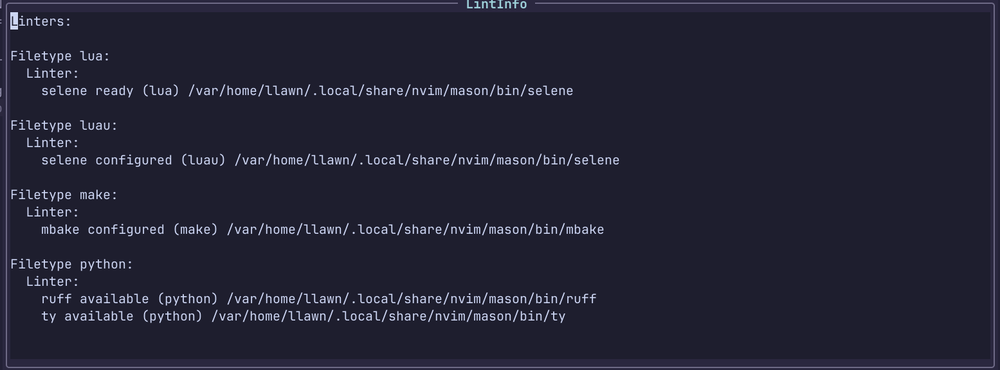

# Keymaps

This page provides a comprehensive reference of all key mappings in the LLawn
Neovim configuration, organized by category and functionality.

## Legend

- **Mode**: `n` (normal), `i` (insert), `v` (visual), `x` (visual block), `t`
  (terminal)
- **Key**: The key combination
- **Description**: What the mapping does

## Popup Menus

| Key     | Mode | Description                                      |
| ------- | ---- | ------------------------------------------------ |
| `<A-w>` | n    | Window popup menu (split, move, close)           |
| `<A-g>` | n    | Git popup menu (status, commit, push, log, diff) |
| `<A-t>` | n    | Treesitter popup menu (parser management)        |
| `<A-m>` | n    | Mason popup menu (server management)             |

### Window Operations

The window menu provides interactive selection for window management:

- **Horizontal Split**: Create horizontal split
- **Vertical Split**: Create vertical split
- **Move Left/Right/Up/Down**: Navigate to adjacent windows
- **Close Window**: Close current window

### Git Operations

The git menu offers advanced git operations:

| Key     | Mode | Description    |
| ------- | ---- | -------------- |
| `<A-g>` | n    | Git Popup Menu |

#### Git Log Menu

Interactive git log with fuzzy search and filtering:

| Key     | Mode | Description                       |
| ------- | ---- | --------------------------------- |
| `<CR>`  | i,n  | Open full diff in floating window |
| `<C-o>` | i,n  | Open commit in browser            |

**Search filters**: `author:john`, `msg:fix`, `hash:abc123`, `type:feat`

#### Git Diff Menu

Select diff type:

- **Unstaged Diff**: Show changes not yet staged
- **Staged Diff**: Show changes ready for commit

### Treesitter Parser Management

The treesitter menu manages syntax parsers:

| Key     | Mode | Description                       |
| ------- | ---- | --------------------------------- |
| `<A-t>` | n    | Treesitter parser management menu |

#### Parser Management Menu

| Key | Mode | Description                |
| --- | ---- | -------------------------- |
| `I` | i    | Install selected parser    |
| `X` | i    | Uninstall selected parser  |
| `U` | i    | Update selected parser     |
| `o` | i    | Open parser repository URL |

### Mason LSP Server Management

The mason menu manages LSP and other servers:

| Key     | Mode | Description                                |
| ------- | ---- | ------------------------------------------ |
| `<A-m>` | n    | Mason telescope menu for server management |

#### Server Management Menu

| Key | Mode | Description               |
| --- | ---- | ------------------------- |
| `I` | i    | Install selected server   |
| `X` | i    | Uninstall selected server |
| `U` | i    | Update selected server    |

**Categories**: All, LSP, DAP, Linters, Formatters, Other

## Editing

### Navigation

| Key      | Mode  | Description                    |
| -------- | ----- | ------------------------------ |
| `j`      | n,x   | Move cursor down (visual line) |
| `k`      | n,x   | Move cursor up (visual line)   |
| `<Down>` | n,x,i | Move cursor down (visual line) |
| `<Up>`   | n,x,i | Move cursor up (visual line)   |

### Text Manipulation

| Key     | Mode  | Description                        |
| ------- | ----- | ---------------------------------- |
| `<C-q>` | n     | Enter Visual Block mode            |
| `<A-k>` | n,i,v | Move current line/selection up     |
| `<A-j>` | n,i,v | Move current line/selection down   |
| `<C-c>` | x     | Copy selection to system clipboard |
| `<C-x>` | x     | Cut selection to system clipboard  |
| `<C-v>` | n,i,x | Paste from system clipboard        |
| `<C-a>` | n     | Select all text                    |
| `<C-z>` | n     | Undo                               |
| `<C-y>` | n     | Redo                               |

### File Operations

| Key         | Mode  | Description                                           |
| ----------- | ----- | ----------------------------------------------------- |
| `<C-s>`     | n,i,v | Save current file                                     |
| `<leader>w` | n     | Save current file                                     |
| `<leader>R` | n     | Reload Nvim config                                    |
| `<leader>S` | n     | Source current file                                   |
| `<leader>q` | n     | Smart quit (opens quit menu if unsaved buffers exist) |

### Quit Operations

The quit system provides intelligent handling of unsaved files:

- **Smart Quit**: If no unsaved buffers, quits immediately; otherwise opens quit
  menu

- **Quit Menu Options**:

    - Unsaved Menu: Interactive handling of unsaved buffers with diff preview
    - Force Quit: Quit without saving
    - Save All and Quit: Save all modified buffers and quit

#### Unsaved Buffers Menu

When unsaved buffers exist, a Telescope picker shows:

- **u**: Save selected file
- **d**: Discard changes for selected file
- **U**: Save all files
- **D**: Discard all changes

Each entry shows a diff preview of unsaved changes.

#### Swap Files Menu

When swap files exist for closed buffers, a Telescope picker shows:

| Key    | Mode | Description                            |
| ------ | ---- | -------------------------------------- |
| `<CR>` | i,n  | Recover selected file (simple recover) |
| `r`    | i    | Recover selected file                  |
| `x`    | i    | Delete selected swap file              |
| `X`    | i    | Delete all swap files                  |

Each entry shows a diff preview between saved file and swap content.

## File Management

### Explorer

| Key          | Mode | Description                            |
| ------------ | ---- | -------------------------------------- |
| `<leader>x`  | n    | Open file explorer (Yazi if configure) |
| `<leader>-`  | n,v  | Open Yazi at current file              |
| `<leader>cw` | n    | Open Yazi in current working directory |
| `<c-up>`     | n    | Resume last Yazi session               |

### Yazi Integration

| Key     | Mode | Description            |
| ------- | ---- | ---------------------- |
| `<c-l>` | t    | Open LazyGit from Yazi |
| `<c-x>` | t    | Quit LazyGit to Yazi   |

## Navigation

### Buffer Management

| Key          | Mode | Description                |
| ------------ | ---- | -------------------------- |
| `<leader>bb` | n    | Switch to alternate buffer |
| `<leader>bn` | n    | Next buffer                |
| `<leader>bp` | n    | Previous buffer            |

### Harpoon (Quick File Navigation)

| Key         | Mode | Description                      |
| ----------- | ---- | -------------------------------- |
| `<leader>a` | n    | Add current file to Harpoon list |
| `<C-e>`     | n    | Toggle Harpoon quick menu        |
| `<C-1>`     | n    | Select Harpoon file 1            |
| `<C-2>`     | n    | Select Harpoon file 2            |
| `<C-3>`     | n    | Select Harpoon file 3            |

### Telescope (Fuzzy Finder)

| Key           | Mode | Description             |
| ------------- | ---- | ----------------------- |
| `<leader>ff`  | n    | Find Files              |
| `<leader>fgf` | n    | Git Files               |
| `<leader>fr`  | n    | Frecency (Smart Recent) |
| `<leader>fl`  | n    | Live Grep (Args)        |
| `<leader>fw`  | n    | Find word               |
| `<leader>fp`  | n    | Projects                |
| `<leader>ft`  | n    | Undo Tree               |
| `<leader>fb`  | n    | Buffers                 |
| `<leader>fh`  | n    | Help Tags               |
| `<leader>fk`  | n    | Search Keymaps          |
| `<leader>fie` | n    | Insert Emoji            |
| `<leader>fij` | n    | Insert Julia            |
| `<leader>fig` | n    | Insert Gitmoji          |
| `<leader>fik` | n    | Insert Kaomoji          |
| `<leader>fil` | n    | Insert LaTeX Symbols    |
| `<leader>fim` | n    | Insert Math Symbols     |
| `<leader>fin` | n    | Insert Nerd Fonts       |
| `<leader>fgb` | n    | Git Branches            |
| `<leader>fgc` | n    | Git Commits             |
| `<leader>fgs` | n    | Git Status              |
| `<leader>fgi` | n    | GH Issues               |
| `<leader>fgp` | n    | GH Pull Requests        |
| `<leader>fgw` | n    | GH Workflow Runs        |
| `<leader>fu`  | n    | Unsaved Files           |
| `<leader>fs`  | n    | Swap Files              |

## LSP (Language Server Protocol)

### Navigation

| Key  | Mode | Description         |
| ---- | ---- | ------------------- |
| `gd` | n    | LSP Definition      |
| `gD` | n    | LSP Declaration     |
| `gi` | n    | LSP Implementations |
| `gR` | n    | LSP References      |
| `gt` | n    | LSP Type Definition |

### Code Actions

| Key          | Mode | Description              |
| ------------ | ---- | ------------------------ |
| `<leader>pa` | n,v  | Code Action              |
| `<leader>pn` | n    | Rename                   |
| `<leader>pf` | n    | Format with confirmation |
| `<leader>pl` | n    | Trigger linting          |

### Diagnostics

| Key          | Mode | Description                       |
| ------------ | ---- | --------------------------------- |
| `<leader>dd` | n    | Show Diagnostic                   |
| `<leader>db` | n    | Buffer Diagnostics                |
| `<leader>dc` | n    | Copy Buffer Diagnostics           |
| `<leader>dC` | n    | Copy Buffer Diagnostics by Source |
| `<leader>ds` | n    | Show Buffer Diagnostics           |
| `<leader>dS` | n    | Show Buffer Diagnostics by Source |
| `[d`         | n    | Prev Diagnostic                   |
| `]d`         | n    | Next Diagnostic                   |

### Documentation

| Key          | Mode | Description             |
| ------------ | ---- | ----------------------- |
| `K`          | n    | Signature help (normal) |
| `<C-k>`      | i    | Signature Help (insert) |
| `<leader>pd` | n    | Function Doc            |
| `<leader>ph` | n    | Toggle Inlay Hints      |
| `<leader>pm` | n    | Toggle Markdown Render  |
| `<leader>pt` | n    | Type Doc                |
| `<leader>ps` | n    | Restart LSP             |

### Commands

| Command    | Description              |
| ---------- | ------------------------ |
| `:LintInfo` | Show linting information |



## Treesitter

### Syntax Tree Inspection

| Key          | Mode | Description                              |
| ------------ | ---- | ---------------------------------------- |
| `<A-t>`      | n    | Treesitter parser management menu        |
| `<leader>tp` | n    | Open treesitter playground (InspectTree) |
| `<leader>th` | n    | Toggle treesitter highlight for buffer   |
| `<leader>ts` | n    | Find symbols (Treesitter symbols menu)   |

### Parser Management

| Key | Mode | Description                                    |
| --- | ---- | ---------------------------------------------- |
| `I` | i    | Install selected parser (in Treesitter menu)   |
| `X` | i    | Uninstall selected parser (in Treesitter menu) |
| `U` | i    | Update selected parser (in Treesitter menu)    |

### Text Objects

| Key  | Mode | Description       |
| ---- | ---- | ----------------- |
| `aa` | o,x  | Parameter Outer   |
| `ia` | o,x  | Parameter Inner   |
| `ab` | o,x  | Block Outer       |
| `ib` | o,x  | Block Inner       |
| `ac` | o,x  | Class Outer       |
| `ic` | o,x  | Class Inner       |
| `af` | o,x  | Function Outer    |
| `if` | o,x  | Function Inner    |
| `ai` | o,x  | Conditional Outer |
| `ii` | o,x  | Conditional Inner |
| `al` | o,x  | Loop Outer        |
| `il` | o,x  | Loop Inner        |
| `am` | o,x  | Call Outer        |
| `im` | o,x  | Call Inner        |
| `as` | o,x  | Statement Outer   |
| `is` | o,x  | Statement Inner   |

### Movement

| Key  | Mode | Description                |
| ---- | ---- | -------------------------- |
| `]f` | n    | Next function start        |
| `]c` | n    | Next class start           |
| `]l` | n    | Next loop start            |
| `]a` | n    | Next parameter start       |
| `]b` | n    | Next block start           |
| `]i` | n    | Next conditional start     |
| `]s` | n    | Next statement start       |
| `]m` | n    | Next call start            |
| `]F` | n    | Next function end          |
| `]C` | n    | Next class end             |
| `]L` | n    | Next loop end              |
| `]A` | n    | Next parameter end         |
| `]B` | n    | Next block end             |
| `]I` | n    | Next conditional end       |
| `]S` | n    | Next statement end         |
| `]M` | n    | Next call end              |
| `[f` | n    | Previous function start    |
| `[c` | n    | Previous class start       |
| `[l` | n    | Previous loop start        |
| `[a` | n    | Previous parameter start   |
| `[b` | n    | Previous block start       |
| `[i` | n    | Previous conditional start |
| `[s` | n    | Previous statement start   |
| `[m` | n    | Previous call start        |
| `[F` | n    | Previous function end      |
| `[C` | n    | Previous class end         |
| `[L` | n    | Previous loop end          |
| `[A` | n    | Previous parameter end     |
| `[B` | n    | Previous block end         |
| `[I` | n    | Previous conditional end   |
| `[S` | n    | Previous statement end     |
| `[M` | n    | Previous call end          |

### Incremental Selection

| Key   | Mode | Description                          |
| ----- | ---- | ------------------------------------ |
| `gnn` | n    | Start incremental selection          |
| `grn` | n,v  | Increment selection to next node     |
| `grc` | n,v  | Increment selection to next scope    |
| `grm` | n,v  | Decrement selection to previous node |

### Swap

| Key          | Mode | Description     |
| ------------ | ---- | --------------- |
| `<leader>sp` | n    | Swap Param Next |
| `<leader>sP` | n    | Swap Param Prev |

### Movement

| Key  | Mode | Description          |
| ---- | ---- | -------------------- |
| `]a` | n    | Next Parameter       |
| `[a` | n    | Prev Parameter       |
| `]A` | n    | Next Parameter End   |
| `[A` | n    | Prev Parameter End   |
| `]b` | n    | Next Block           |
| `[b` | n    | Prev Block           |
| `]B` | n    | Next Block End       |
| `[B` | n    | Prev Block End       |
| `]c` | n    | Next Class           |
| `[c` | n    | Prev Class           |
| `]C` | n    | Next Class End       |
| `[C` | n    | Prev Class End       |
| `]f` | n    | Next Function        |
| `[f` | n    | Prev Function        |
| `]F` | n    | Next Function End    |
| `[F` | n    | Prev Function End    |
| `]i` | n    | Next Conditional     |
| `[i` | n    | Prev Conditional     |
| `]I` | n    | Next Conditional End |
| `[I` | n    | Prev Conditional End |
| `]l` | n    | Next Loop            |
| `[l` | n    | Prev Loop            |
| `]L` | n    | Next Loop End        |
| `[L` | n    | Prev Loop End        |
| `]m` | n    | Next Call            |
| `[m` | n    | Prev Call            |
| `]M` | n    | Next Call End        |
| `[M` | n    | Prev Call End        |
| `]s` | n    | Next Statement       |
| `[s` | n    | Prev Statement       |
| `]S` | n    | Next Statement End   |
| `[S` | n    | Prev Statement End   |

### Incremental Selection

| Key   | Mode | Description       |
| ----- | ---- | ----------------- |
| `gnn` | n    | Init Selection    |
| `grn` | n,v  | Node Incremental  |
| `grc` | n,v  | Scope Incremental |
| `grm` | n,v  | Node Decremental  |

## Mason

### LSP Server Management

| Key     | Mode | Description                                     |
| ------- | ---- | ----------------------------------------------- |
| `<A-m>` | n    | Open Mason telescope menu for server management |
| `I`     | i    | Install selected server (in Mason menu)         |
| `X`     | i    | Uninstall selected server (in Mason menu)       |
| `U`     | i    | Update selected server (in Mason menu)          |

## Development Tools

### Git Integration

#### LazyGit

| Key          | Mode | Description |
| ------------ | ---- | ----------- |
| `<leader>gg` | n    | LazyGit     |

#### Gitsigns

| Key          | Mode | Description         |
| ------------ | ---- | ------------------- |
| `<leader>gb` | n    | Blame Line          |
| `<leader>gd` | n    | Diff This           |
| `<leader>gD` | n    | Diff This           |
| `<leader>gh` | o,x  | Select Hunk         |
| `<leader>gi` | n    | Preview Hunk Inline |
| `<leader>gl` | n    | Toggle Blame        |
| `<leader>gp` | n    | Preview Hunk        |
| `<leader>gq` | n    | Quickfix            |
| `<leader>gQ` | n    | Quickfix All        |
| `<leader>gr` | n,v  | Reset Hunk          |
| `<leader>gR` | n    | Reset Buffer        |
| `<leader>gs` | n,v  | Stage Hunk          |
| `<leader>gS` | n    | Stage Buffer        |
| `<leader>gw` | n    | Toggle Word Diff    |
| `]h`         | n    | Next Hunk           |
| `[h`         | n    | Prev Hunk           |

### Harpoon

| Key          | Mode | Description         |
| ------------ | ---- | ------------------- |
| `<leader>a`  | n    | Add to Harpoon      |
| `<C-e>`      | n    | Open harpoon window |
| `<C-1>`      | n    | Harpoon 1           |
| `<C-2>`      | n    | Harpoon 2           |
| `<C-3>`      | n    | Harpoon 3           |
| `<leader>hn` | n    | Harpoon next        |
| `<leader>hp` | n    | Harpoon previous    |

### Documentation Generation

| Key          | Mode | Description                   |
| ------------ | ---- | ----------------------------- |
| `<leader>nf` | n    | Generate function docstring   |
| `<leader>nt` | n    | Generate type/class docstring |

### Color Tools

| Key          | Mode | Description                              |
| ------------ | ---- | ---------------------------------------- |
| `<leader>cc` | n    | Open Telescope color picker (:HexColors) |
| `<leader>cC` | n    | Open 2D grid color picker (:ColorPick2D) |

### Undo Management

| Key         | Mode | Description     |
| ----------- | ---- | --------------- |
| `<leader>u` | n    | Toggle UndoTree |

## Lua Development

### Code Execution

| Key          | Mode | Description                |
| ------------ | ---- | -------------------------- |
| `<leader>S`  | n    | Source current file        |
| `<leader>lf` | n    | Execute Lua file           |
| `<leader>lx` | n    | Execute current line (Lua) |
| `<leader>lx` | v    | Execute selection (Lua)    |

## UI Toggles

### Display Options

| Key     | Mode | Description            |
| ------- | ---- | ---------------------- |
| `<C-l>` | n    | Toggle list characters |

## Custom Keymap Groups

### Leader Key (`<leader>`)

The leader key is set to ` ` (whitespace) by default. All `<leader>` mappings
use this prefix.

### Control Key Combinations

- `<C-w>`: Window operations
- `<C-g>`: Git operations
- `<C-t>`: Tree-sitter operations
- `<C-l>`: UI toggles listchars
- `<C-q>`: Visual block mode
- `<C-c/x/v>`: System clipboard
- `<C-a/z/y>`: File operations
- `<C-s>`: Save file
- `<C-1/2/3>`: Harpoon file selection
- `<C-e>`: Harpoon menu
- `<C-k>`: Signature help (insert mode)
- `<C-Space>`: CMP complete (insert mode)
- `<C-Up>`: Yazi resume

### Alt Key Combinations

- `<A-k/j>`: Move lines up/down
- `<A-g>`: Git menu
- `<A-m>`: Mason menu
- `<A-t>`: Treesitter menu
- `<A-w>`: Window menu

### Special Modes

- **Terminal Mode**: `<c-l>`, `<c-x>` for Yazi/LazyGit switching

## Customization

### Adding Keymaps

Keymaps are defined in `lua/llawn/config/keymaps.lua`. To add new mappings:

```lua
vim.keymap.set("n", "<leader>your_key", your_command, { desc = "Description" })
```

### Plugin Keymaps

Plugin-specific keymaps are defined in their respective configuration files in
`lua/llawn/plugins/`.

This comprehensive keymap system provides efficient, mnemonic access to all
Neovim functionality while maintaining discoverability through Which-Key
integration.
